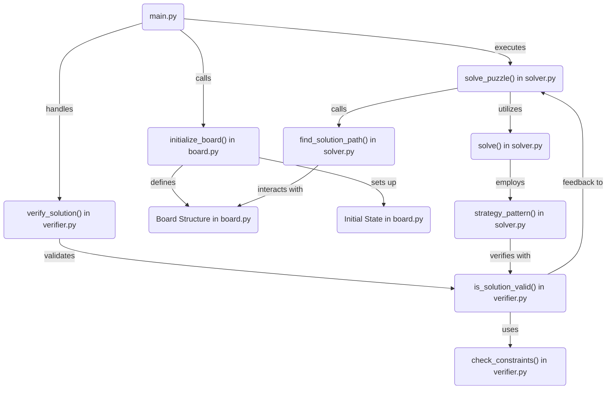

# Python Puzzle Solver: An Innovative Approach to Problem-Solving

Welcome to my Python Puzzle Solver repository, where complex problems meet elegant solutions. This project encapsulates my journey into algorithm design, logical reasoning, and software engineering, demonstrating my ability to tackle challenging puzzles with code.

## Project Overview

This Python Puzzle Solver is a comprehensive system designed to automate the solving, verification, and proof generation of puzzle-like problems. It showcases my programming prowess, deep understanding of algorithms, and passion for creating efficient, scalable solutions.

### Core Components

- **`board.py`**: Defines the puzzle board, setting the stage for problem-solving with data structures that efficiently represent the state and transitions of the puzzle.
- **`main.py`**: The entry point of the application, orchestrating the workflow from problem definition to solution presentation.
- **`prover.py`**: Generates proofs for the solutions, ensuring that each solution meets all given constraints and is logically sound.
- **`solver.py`**: Implements advanced algorithms to explore possible solutions, optimized for performance to handle complex puzzles swiftly.
- **`verifier.py`**: Verifies the correctness of the proposed solution, employing rigorous checks to guarantee solution validity.

## Skills and Strengths Demonstrated

- **Algorithmic Efficiency**: Expertise in designing and implementing algorithms that solve problems optimally and efficiently.
- **Code Organization**: Mastery in structuring code that is both maintainable and scalable, facilitating future enhancements and modifications.
- **Logical Problem-Solving**: Ability to decompose complex problems into manageable components, applying logical reasoning to devise sound solutions.
- **Performance Optimization**: Proficiency in optimizing code to improve execution speed and resource utilization, crucial for solving large-scale problems.

## Visual Overview



## Getting Started

To explore this puzzle solver:

1. Clone the repository to your local machine.
2. Navigate to the repository directory and run `main.py` to see the solver in action.

```bash
git clone https://github.com/YourUsername/Python-Puzzle-Solver.git
cd Python-Puzzle-Solver
python main.py
```

Thank you for exploring my Python Puzzle Solver project. I look forward to contributing my skills to your team and tackling new challenges together!
